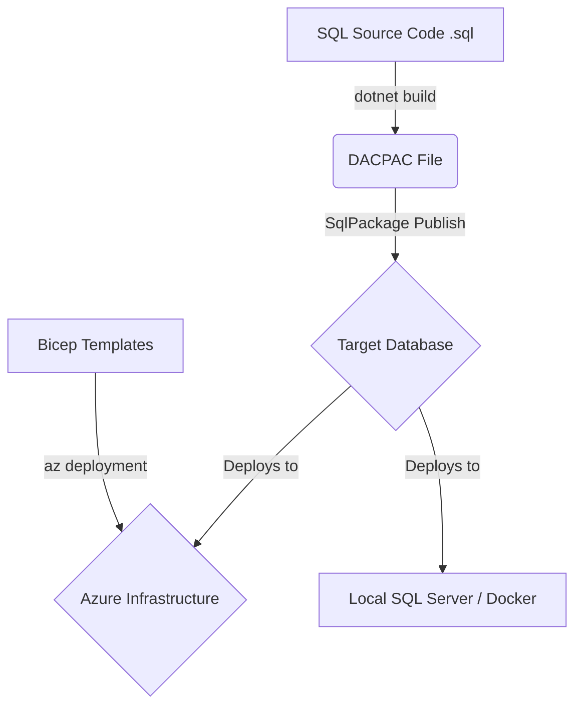

# SQL Server Code-as-Infrastructure POC

This repository serves as a modern Proof of Concept (POC) demonstrating how to develop, version-control, and deploy SQL Server schemas using **Database-as-Code** principles. It leverages Microsoft's modern, cross-platform **SDK-style SQL projects** (`.sqlproj`), **Azure Bicep** for Infrastructure-as-Code, and **SqlPackage (DACPAC)** for schema migrations.

---

## Architecture Overview



### Key Technologies Used

1. **SDK-style SQL Database Project (`Microsoft.Build.Sql`)**: The modern version of SQL Database projects. Unlike older Visual Studio-bound project files, this format is lightweight, platform-agnostic, and compiles via the cross-platform `.NET CLI` (`dotnet build`).
2. **DACPAC (Data-tier Application Package)**: A compiled database schema artifact containing all object definitions (tables, views, stored procedures).
3. **SqlPackage**: Microsoft's command-line tool used to compare a `.dacpac` schema against a target database and generate/apply incremental delta scripts (safe migrations) to align the database state with your source code.
4. **Azure Bicep**: A domain-specific language (DSL) that uses declarative syntax to deploy Azure SQL infrastructure.
5. **GitHub Actions & Azure Pipelines**: Two independent native CI/CD workflows demonstrating how to compile, provision, and deploy automatically.

---

## Directory Structure

```
/
├── .github/workflows/
│   ├── build-and-deploy-azure.yml   # GitHub Actions pipeline for Azure deployments
│   └── build-and-deploy-local.yml   # GitHub Actions pipeline for local deployments
├── azure-pipelines/
│   ├── deploy-azure.yml                 # Azure Pipelines YAML for Azure deployments
│   └── deploy-local.yml                 # Azure Pipelines YAML for local deployments
├── infra/azure/
│   ├── main.bicep                       # Azure SQL Server/DB provisioning template
│   └── main.parameters.json             # Bicep parameters template
├── src/Database/
│   ├── Database.sqlproj                 # Modern SDK-style project file
│   ├── Tables/                          # Table schemas (Customers, Orders)
│   ├── Views/                           # Database view schemas (v_CustomerOrders)
│   └── StoredProcedures/                # Stored procedures (GetCustomerSummary)
├── docker-compose.yml                   # SQL Server Docker setup for local development
├── .gitignore                           # Git ignore configurations
└── README.md                            # Setup and execution manual (this file)
```

---

## 1. Local Development Setup

### Target Assumptions

- **Local Deployment**: This POC assumes that an **existing, empty SQL Server instance** is already installed and running on the target environment.
- **Developer Sandbox**: An optional `docker-compose.yml` file is provided to spin up a local SQL Server 2022 Developer container to facilitate offline development and mock testing.

### Minimum System Requirements

- **Operating System**: Windows 10/11, macOS 12+, or Linux (Ubuntu 20.04+).
- **.NET SDK**: version `8.0.x` or later.
- **Docker Desktop** (or Docker Engine): Only if running the optional developer sandbox.
- **SqlPackage CLI**: (Required for local manual deployments).
- **Azure CLI (Optional)**: If deploying/validating Bicep files locally.

### Step 1: Spin Up Local SQL Server (Optional Sandbox)

To run a local SQL Server 2022 instance in a Docker container for testing:

```bash
docker-compose up -d
```

- This runs SQL Server at `localhost,1433`.
- Default username is `sa`.
- Default password is `LocalPocPassword123!`.

### Step 2: Build the Database Project

Compile the T-SQL schemas into a DACPAC. Navigate to the database project folder and run build:

```bash
cd src/Database
dotnet build -c Release
```

The compiled artifact will be generated at: `src/Database/bin/Release/Database.dacpac`.

### Step 3: Deploy Schema Manually using SqlPackage

Ensure you have the [SqlPackage CLI tool installed](https://learn.microsoft.com/en-us/sql/tools/sqlpackage/sqlpackage-download). Run the following command from the root of the repository to publish the schema to your local instance:

```powershell
sqlpackage /Action:Publish `
  /SourceFile:".\src\Database\bin\Release\Database.dacpac" `
  /TargetServerName:"localhost,1433" `
  /TargetDatabaseName:"poc_database" `
  /TargetUser:"sa" `
  /TargetPassword:"LocalPocPassword123!" `
  /Variables:AllowIncompatiblePlatform=true
```

> [!NOTE]
> The `/Variables:AllowIncompatiblePlatform=true` flag is required if you are deploying a project targeted to SQL Server 2022 (`Sql160DatabaseSchemaProvider`) to a platform that matches but is hosted in a slightly different environment (e.g. Linux-based container).

---

## 2. Infrastructure as Code (Azure Bicep)

The Azure SQL logical server and database are defined declaratively in `infra/azure/main.bicep`.

To deploy or validate this infrastructure locally via the Azure CLI:

```bash
# Log in to Azure
az login

# Create a resource group if you don't have one
az group create --name rg-auto-sql-poc --location eastus

# Deploy the infrastructure (passing the secure administrator password at prompt)
az deployment group create \
  --resource-group rg-auto-sql-poc \
  --template-file infra/azure/main.bicep \
  --parameters @infra/azure/main.parameters.json \
  --parameters administratorLoginPassword="MyStrongAzureSqlPassword123!"
```

---

## 3. CI/CD Pipeline Setup

### Option A: GitHub Actions

#### Azure SQL Database Deployment (GitHub Actions)

1. Set up **OpenID Connect (OIDC) Federated Credentials** in Azure AD / Entra ID for GitHub, or create a Service Principal with Contributor access to the resource group.
2. In GitHub, navigate to **Settings > Secrets and variables > Actions** and add the following repository secrets:
   - `AZURE_CLIENT_ID`: The application client ID of your Azure Active Directory service principal.
   - `AZURE_TENANT_ID`: Your Azure tenant ID.
   - `AZURE_SUBSCRIPTION_ID`: Your Azure subscription ID.
   - `AZURE_RESOURCE_GROUP`: The name of the resource group (e.g., `rg-auto-sql-poc`).
   - `SQL_ADMIN_USER`: The admin user specified in Bicep parameters (e.g., `sqladmin`).
   - `SQL_ADMIN_PASSWORD`: A secure password for the Azure SQL server administrator.
3. Push changes to the `main` branch. This triggers the [build-and-deploy-azure.yml](.github/workflows/build-and-deploy-azure.yml) workflow, provisioning infrastructure and publishing the database schema.

#### Local SQL Server Deployment (via Self-Hosted Runner)

1. Install the GitHub Actions runner agent on a machine inside your internal corporate network (e.g., the server hosting SQL Server, or a machine with network access to it).
2. Configure the runner to use the `self-hosted` tag.
3. Ensure the runner host machine has **SqlPackage** installed and added to the environment's system `PATH` (so calling `sqlpackage` via PowerShell works).
4. Add these secrets to GitHub:
   - `LOCAL_SQL_SERVER`: Local database host/IP (e.g., `10.0.0.5` or `localhost,1433`).
   - `LOCAL_SQL_DATABASE`: Name of target database (e.g., `poc_database`).
   - `LOCAL_SQL_USER`: Database deployment username (e.g., `sa` or deployment service account).
   - `LOCAL_SQL_PASSWORD`: Password for target database user.
5. Push to `main` to run [build-and-deploy-local.yml](.github/workflows/build-and-deploy-local.yml).

---

### Option B: Azure DevOps Pipelines

#### Azure SQL Database Deployment (Azure DevOps)

1. In Azure DevOps, create an **Azure Resource Manager Service Connection** (Automatic or Service Principal manual) pointing to your subscription and target resource group. Name it `MyAzureServiceConnection`.
2. In your pipeline project, create a **Variable Group** named `SQL-POC-Secrets` or add variables directly to your pipeline:
   - `AZURE_SUBSCRIPTION_ID`: Target subscription ID.
   - `SQL_ADMIN_PASSWORD`: Mark this as a **Secret variable** so it is masked in output logs.
3. Create a new Pipeline pointing to [azure-pipelines/deploy-azure.yml](azure-pipelines/deploy-azure.yml) and run it.

#### Local SQL Server Deployment (Self-Hosted Agent)

1. Install an Azure DevOps self-hosted agent on a server inside your corporate network.
2. Register the agent in a pool named `Default` (or update the pool name in [azure-pipelines/deploy-local.yml](azure-pipelines/deploy-local.yml)).
3. Make sure the agent machine runs Windows and has **SqlPackage** and **.NET Core SDK 8.0** installed.
4. Add `SQL_PASSWORD` as a secret variable in your pipeline.
5. Trigger the pipeline using [azure-pipelines/deploy-local.yml](azure-pipelines/deploy-local.yml).

---

## 4. Database Security & Access Control

The project includes declarative security configuration located under `src/Database/Security/`:

- **Roles**: [AppRole.sql](file:///c:/Users/andrew.schwegler/auto_sql/src/Database/Security/Roles/AppRole.sql) creates a custom database role `AppRole`.
- **SQL Application User**: [AppUser.sql](file:///c:/Users/andrew.schwegler/auto_sql/src/Database/Security/Users/AppUser.sql) creates `AppUser` without a server login.
- **Active Directory / Windows Domain User**: [AppDomainGroup.sql](file:///c:/Users/andrew.schwegler/auto_sql/src/Database/Security/Users/AppDomainGroup.sql) maps a Windows Domain group `CORP\AppDomainGroup` to the database using `FROM WINDOWS`.
- **Permissions**: [Permissions.sql](file:///c:/Users/andrew.schwegler/auto_sql/src/Database/Security/Permissions.sql) defines role membership assignments and grants schema-wide read/write/execute permissions to `AppRole`.

> [!WARNING]
> Because Azure SQL Database does not support Windows/AD Domain users (e.g. `FROM WINDOWS`), the Azure deployment pipelines are configured to use the SqlPackage flag `/p:ExcludeObjectTypes=Users;RoleMemberships` to bypass these objects. In Azure environments, security principles are typically mapped via Entra ID (using `FROM EXTERNAL PROVIDER`) or managed at the server/resource deployment level.

---

## 5. Upgrading an Existing SQL Server 2019 Database to SQL Server 2022

To migrate and upgrade an existing SQL Server 2019 database to the SQL Server 2022 declarative format using this repository, follow this state-based migration procedure:

### Step 1: Extract the Schema from SQL Server 2019

Use `SqlPackage` to extract the current schema of the SQL Server 2019 database to a `.dacpac` file. Run this on a machine with network access to the 2019 instance:

```powershell
sqlpackage /Action:Extract `
  /SourceConnectionString:"Server=my2019Server;Database=myDatabaseName;Integrated Security=True;Encrypt=True;TrustServerCertificate=True;" `
  /TargetFile:".\myDb2019Schema.dacpac"
```

### Step 2: Import Schema into the Database Project

You can import the extracted `.dacpac` into this database project folder structure to begin managing it in Git. Using Visual Studio or Azure Data Studio (with the SQL Database Projects extension):

1. Right-click on the database project.
2. Select **Import > Data-tier Application Package (.dacpac)**.
3. Select your extracted `myDb2019Schema.dacpac`.
This will automatically generate the declarative T-SQL script files for all your tables, views, stored procedures, and roles.

### Step 3: Configure Target to SQL Server 2022

In the database project's `.sqlproj` file, update the Database Schema Provider (`DSP`) to target SQL Server 2022:

```xml
<DSP>Microsoft.Data.Tools.Schema.Sql.Sql160DatabaseSchemaProvider</DSP>
```

### Step 4: Build & Validate Compatibility

Compile the project locally targeting the new platform version using:

```bash
dotnet build src/Database/Database.sqlproj -c Release
```

The MSBuild engine compiles the schemas against the SQL Server 2022 compiler. This will flag any syntax errors, deprecated features (e.g. old style outer joins `*=`), or compatibility issues before deployment. Resolving compilation errors at this stage guarantees compatibility with SQL Server 2022.

### Step 5: Publish Schema to SQL Server 2022 Target

Deploy the compiled DACPAC to the new, empty SQL Server 2022 target instance. SqlPackage will compare the schema against the target database, generate an incremental script, and safely apply it:

```powershell
sqlpackage /Action:Publish `
  /SourceFile:".\src\Database\bin\Release\Database.dacpac" `
  /TargetConnectionString:"Server=my2022Server;Database=myDatabaseName;Integrated Security=True;Encrypt=True;TrustServerCertificate=True;"
```

*Note: Once published, upgrade the database compatibility level to SQL Server 2022 (160) by running:*

```sql
ALTER DATABASE [myDatabaseName] SET COMPATIBILITY_LEVEL = 160;
```

---

## 6. Advanced Multi-Database and Server-Level Architectures

Enterprise SQL Server instances frequently host multiple databases, utilize server-level objects in the `master` database, and rely on SQL Server Agent Jobs in the `msdb` database. This POC is designed to accommodate these requirements cleanly:

### A. Hosting Multiple Databases (Cross-Database Queries)

When a server hosts multiple databases with dependencies between them, each database must have its own subdirectory and `.sqlproj` project file under `src/` (e.g., `src/DatabaseA` and `src/DatabaseB`).

To execute cross-database queries without causing build validation errors:

1. **Add a Database Reference**: Right-click the consuming project (e.g., `DatabaseA`) in Azure Data Studio or Visual Studio, select **Add Database Reference**, and choose the second project (`DatabaseB`).
2. **Configure SQLCMD Variables**: Assign a database variable name (e.g., `DatabaseB`).
3. **Use the Variable in Code**: Refer to the external database tables in T-SQL using SQLCMD syntax:

   ```sql
   SELECT * FROM [$(DatabaseB)].[dbo].[ExternalTable];
   ```

This compiles cleanly because the compiler references the schema of `DatabaseB` during the build phase of `DatabaseA`.

### B. Server-Level Stored Procedures (`master` Database)

For stored procedures that must run at the server level (e.g., custom database health diagnostics or monitoring scripts):

- We provide a separate project [MasterDatabase.sqlproj](file:///c:/Users/andrew.schwegler/auto_sql/src/MasterDatabase/MasterDatabase.sqlproj) that compiles independently and compiles directly to the `master` system database.
- The sample procedure [sp_LocalPocDiagnostics.sql](file:///c:/Users/andrew.schwegler/auto_sql/src/MasterDatabase/StoredProcedures/sp_LocalPocDiagnostics.sql) uses the system prefix `sp_`. By deploying this procedure to the `master` database, it can be called from **any** database context on the server without referencing the `master` namespace:

  ```sql
  -- Executable from any user database on the host server:
  EXEC dbo.sp_LocalPocDiagnostics;
  ```

### C. SQL Server Agent Jobs & Schedules (`msdb` Database)

SQL Server Agent Jobs, job steps, and schedules are server-level objects stored in the `msdb` system database. Since they are not schema-level objects in the user database, they cannot be declared as standard `.sql` files inside the database project.

Instead, we manage jobs inside the source-controlled project using a **Post-Deployment Script**:

1. **Post-Deployment Script**: The file [Script.PostDeployment.sql](file:///c:/Users/andrew.schwegler/auto_sql/src/Database/Script.PostDeployment.sql) is registered in [Database.sqlproj](file:///c:/Users/andrew.schwegler/auto_sql/src/Database/Database.sqlproj) under a `<PostDeploy>` action. It runs automatically after the main schema is updated.
2. **Cloud/On-Premises Guard**: The script checks `@@VERSION` at runtime:
   - If deploying to Azure SQL (where SQL Agent is not supported), it skips job setup gracefully.
   - If deploying to a local/on-prem SQL Server, it proceeds to configure the jobs.
3. **Idempotent Job Setup**: The script safely drops existing jobs before re-creating them using `msdb.dbo.sp_delete_job` and `msdb.dbo.sp_add_job`. This ensures changes made to jobs in source control are applied cleanly during subsequent pipeline runs.
4. **Dynamic Database Execution**: The job steps are configured using `db_name()` for the `@database_name` parameter, making sure the job step runs against the database to which the DACPAC was published.

### D. Capturing Server-Level Logins & Configurations (Pre-Deployment)

A user database DACPAC is database-scoped. It contains database users, but **does not contain the server-level Logins** (SQL or Windows logins) that those users map to. If you deploy a DACPAC containing a user (e.g., `AppUser` or `LMIREADONLY`) to a server that lacks the matching login, the deployment will fail.

To solve this, we provide an automated extraction script [Extract-ServerConfig.ps1](file:///c:/Users/andrew.schwegler/auto_sql/scripts/Extract-ServerConfig.ps1) in the `scripts/` folder. This script connects to your source server, queries catalog views, and generates an idempotent T-SQL script containing:

- **SQL Logins**: Scripted preserving their original **Security Identifier (SID)** and **Password Hash**. Preserving SIDs is critical—if the login is created on the target server with the same SID, the DACPAC database users map to it automatically with no extra configuration.
- **Windows Logins**: Active Directory logins configured via Windows authentication.
- **Server Role Memberships**: Mapping logins to server roles (e.g., `sysadmin`, `dbcreator`).
- **Linked Servers**: Recreating linked servers via `sp_addlinkedserver`.

#### Running the Script

To query your source environment and output the script, run the PowerShell script from the repository root:

```powershell
.\scripts\Extract-ServerConfig.ps1 `
  -ServerInstance "mySourceSqlServer" `
  -OutputFile "src/Database/PreDeployment-ServerConfig.sql"
```

> [!IMPORTANT]
> The generated `PreDeployment-ServerConfig.sql` script must be run on the target SQL Server instance **before** deploying the DACPAC to ensure all logins exist and SIDs align.

### E. Auto-Fixing Orphaned Users (Post-Deployment)

If logins are created on the target server without preserving SIDs, the database users in the DACPAC will become "orphaned" (they will exist in the database but have no link to the server login of the same name).

To handle this automatically, [Script.PostDeployment.sql](file:///c:/Users/andrew.schwegler/auto_sql/src/Database/Script.PostDeployment.sql) features a dynamic orphan-healing cursor:

- It queries the database catalog to find users whose SID does not match the server login's SID.
- It automatically executes:

  ```sql
  ALTER USER [OrphanUser] WITH LOGIN = [OrphanUser];
  ```

This links the database user back to the server login of the same name, fixing connection access issues automatically after each build and publish.

---

## 7. Migration & Cutover Runbook

This runbook outlines the steps to perform a safe database upgrade and cutover from an existing SQL Server 2019 instance to a new SQL Server 2022 target instance using this repository.

### Stage 1: Pre-Cutover Preparation (Target Setup)

1. **Provision Infrastructure**: Deploy the target SQL Server 2022 environment (using Bicep for Azure, or installing a local instance).
2. **Extract & Deploy Logins**:
   - Run the automated extraction script against your source SQL Server 2019 instance:

     ```powershell
     .\scripts\Extract-ServerConfig.ps1 -ServerInstance "source-sql-19" -OutputFile "PreDeployment-ServerConfig.sql"
     ```

   - Run the generated `PreDeployment-ServerConfig.sql` script on the target SQL Server 2022 instance. This creates the logins (retaining matching SIDs and Password Hashes) and server roles.

### Stage 2: Cutover Window (Data Migration & Upgrade)

1. **Set Source to Read-Only**: Lock the source database to prevent any new write transactions during copy:

   ```sql
   ALTER DATABASE [myDatabase] SET READ_ONLY WITH ROLLBACK IMMEDIATE;
   ```

2. **Perform Final Backup**: Take a copy-only full backup of the source database:

   ```sql
   BACKUP DATABASE [myDatabase] TO DISK = 'C:\Backup\myDatabase_Cutover.bak' WITH INIT, COPY_ONLY, STATS = 10;
   ```

3. **Restore on Target Server**: Copy the `.bak` file to the target SQL Server 2022 server and restore it:

   ```sql
   RESTORE DATABASE [myDatabase] FROM DISK = 'C:\Backup\myDatabase_Cutover.bak' 
   WITH RECOVERY, 
   MOVE 'myDatabase_Data' TO 'C:\SQLData\myDatabase.mdf',
   MOVE 'myDatabase_Log' TO 'C:\SQLLog\myDatabase.ldf',
   REPLACE, STATS = 10;
   ```

### Stage 3: Post-Restore Schema Upgrade & Orphan Repair

1. **Run the CI/CD Pipeline**: Deploy the user database DACPAC against the newly restored database on the SQL Server 2022 instance.
2. **Schema Upgrade**: `SqlPackage` compares the restored database schema against your DACPAC and safely applies any incremental structural changes.
3. **Orphan User Healing**: The post-deployment script [Script.PostDeployment.sql](file:///c:/Users/andrew.schwegler/auto_sql/src/Database/Script.PostDeployment.sql) automatically triggers at the end of the pipeline run. It loops through all database users, finds mismatched SIDs, and links them back to the server-level logins via `ALTER USER ... WITH LOGIN`.

### Stage 4: Go-Live Checklist

1. **Upgrade Compatibility Level**: Set the database compatibility to SQL Server 2022 (160):

   ```sql
   ALTER DATABASE [myDatabase] SET COMPATIBILITY_LEVEL = 160;
   ```

2. **Update Statistics**: Ensure query optimizer statistics are rebuilt for the SQL Server 2022 estimator engine:

   ```sql
   EXEC sp_updatestats;
   ```

3. **Redirect Applications**: Update application connection strings to point to the new SQL Server 2022 instance.

---

## 8. Things to Watch Out For (Gotchas & Caveats)

When implementing a Database-as-Code pipeline in enterprise environments, watch out for the following:

- **Linked Server Passwords**: SQL Server catalog views encrypt remote login passwords. Therefore, the `Extract-ServerConfig.ps1` script will recreate the linked server metadata, but **cannot script linked server passwords**. You must manually supply or update linked server login passwords post-migration:

  ```sql
  EXEC sp_addlinkedsrvlogin @rmtsrvname = 'MyLinkedServer', @useself = 'FALSE', @locallogin = 'myLocalLogin', @rmtuser = 'myRemoteUser', @rmtpassword = 'mySecurePassword';
  ```

- **Active Directory/Windows Logins in Azure**: Azure SQL Database does not support Windows Auth logins (`FROM WINDOWS`). When deploying pipelines to Azure SQL, make sure the `/p:ExcludeObjectTypes=Users;RoleMemberships` flag is supplied (this is pre-configured in our Azure workflows).
- **SQL Server Agent Status**: If the SQL Server Agent service is stopped on your target server, the agent job configuration in [Script.PostDeployment.sql](file:///c:/Users/andrew.schwegler/auto_sql/src/Database/Script.PostDeployment.sql) will run successfully, but the job will not trigger. Double-check that the agent service is set to "Automatic" startup.
- **Direct (Non-Role) Object Permissions**: Directly granting object permissions (e.g. `GRANT SELECT ON OBJECT::[dbo].[Customers] TO [AppUser]`) requires both the target object and the target user to be defined within the `.sqlproj` build schema. If a user is excluded, the build will throw compilation errors.
- **NuGet Feeds in Restricted Networks**: The modern SDK-style `.sqlproj` format downloads its MSBuild SDK from NuGet at compile time. In offline or private enterprise environments, a [nuget.config](file:///c:/Users/andrew.schwegler/auto_sql/nuget.config) file must be added to route builds through your internal artifact registry (e.g. Nexus or Artifactory).

---

## 9. Database Unit Testing (TDD)

To support **Test-Driven Development (TDD)** inside your SQL database development lifecycle, this repository includes a **native, lightweight T-SQL unit testing framework**.

Unlike frameworks like `tSQLt` (which require CLR integration and setting the database to `TRUSTWORTHY ON`—unsupported or heavily discouraged in Azure SQL Database), this harness runs entirely in native T-SQL and is fully compatible with both on-premises SQL Server and Azure SQL Database.

### A. Testing Structure

All testing components are stored in `src/Database/tests/` under the `tests` schema:

- **Test Results Table**: [TestResults.sql](file:///c:/Users/andrew.schwegler/auto_sql/src/Database/tests/Tables/TestResults.sql) tracks the pass/fail state and error logs for each run.
- **Test Procedures**: Individual test cases are declared as stored procedures prefixed with `test_` (e.g., [test_GetCustomerSummary.sql](file:///c:/Users/andrew.schwegler/auto_sql/src/Database/tests/StoredProcedures/test_GetCustomerSummary.sql)). These procedures set up test data (mock states), execute objects, and throw exceptions if assertions fail.
- **Test Suite Runner**: [RunTests.sql](file:///c:/Users/andrew.schwegler/auto_sql/src/Database/tests/StoredProcedures/RunTests.sql) queries database metadata, executes all test procedures, captures errors, and prints results.

### B. Automated Transaction Rollback

To ensure test runs do not pollute the database, the test suite runner wraps each test inside its own transaction and **automatically rolls it back** at the end of the test:

```sql
BEGIN TRANSACTION;
BEGIN TRY
    EXEC [tests].[test_procedure];
    ROLLBACK TRANSACTION; -- Clean up test data
END TRY
BEGIN CATCH
    ROLLBACK TRANSACTION; -- Clean up test data on failure
END CATCH
```

This isolates tests and ensures your sandbox database is always kept in a clean state.

### C. Testing Complex, Multi-Stage Stored Procedures
For complex stored procedures that process data in multiple stages (such as validating inputs, logging errors, updating staging statuses, and migrating clean records to production), unit tests must verify each distinct business outcome separately:

- **Complex Example Components**:
  - **Staging Table**: [BulkImportQueue.sql](file:///c:/Users/andrew.schwegler/auto_sql/src/Database/dbo/Tables/BulkImportQueue.sql) (landing zone for raw uploads).
  - **Production Table**: [EmployeeWages.sql](file:///c:/Users/andrew.schwegler/auto_sql/src/Database/dbo/Tables/EmployeeWages.sql) (validated wages).
  - **Error Logs**: [BulkProcessErrors.sql](file:///c:/Users/andrew.schwegler/auto_sql/src/Database/dbo/Tables/BulkProcessErrors.sql) (validation failure logs).
  - **Procedures**: [ProcessBulkImport.sql](file:///c:/Users/andrew.schwegler/auto_sql/src/Database/dbo/StoredProcedures/ProcessBulkImport.sql) executes [ValidateBulkImport.sql](file:///c:/Users/andrew.schwegler/auto_sql/src/Database/dbo/StoredProcedures/ValidateBulkImport.sql) to flag rejected rows and migrates valid rows.
- **Multiple Test Scenarios**:
  - **Happy Path Test**: [test_ProcessBulkImport_Success.sql](file:///c:/Users/andrew.schwegler/auto_sql/src/Database/tests/StoredProcedures/test_ProcessBulkImport_Success.sql) loads fully valid records, runs the processor, and asserts that all records migrate to production, 0 are rejected, and 0 errors are logged.
  - **Edge Case / Error Path Test**: [test_ProcessBulkImport_PartialFailure.sql](file:///c:/Users/andrew.schwegler/auto_sql/src/Database/tests/StoredProcedures/test_ProcessBulkImport_PartialFailure.sql) loads valid and invalid records (short SSN or negative wages). It asserts that valid records migrate, invalid records write to `BulkProcessErrors`, and staging records are marked appropriately as `Processed` or `Rejected` without crashing the overall process.

- **TDD Guidelines for Complex SQL Code**:
  1. **Isolate State**: Write test data using a unique `BatchId` (`NEWID()`) so that parallel test executions do not cross-talk.
  2. **Execute**: Run the target stored procedure passing the unique `BatchId` and capture any output parameters.
  3. **Assert Multiple States**: Write explicit `IF` checks on output parameters, production tables, error logs, and staging statuses to verify the database state as a whole. Throw unique error codes (e.g. `THROW 50008`) to isolate which specific check failed.

### D. Pipeline Integration
The pipeline is configured to run tests automatically immediately after schema publishing. If any test fails, the runner throws a SQL exception (`THROW 50000`), failing the pipeline step:

#### GitHub Actions Local Execution

```yaml
- name: Run Database Unit Tests
  run: |
    sqlcmd -S "${{ secrets.LOCAL_SQL_SERVER }}" `
      -d "${{ secrets.LOCAL_SQL_DATABASE }}" `
      -U "${{ secrets.LOCAL_SQL_USER }}" `
      -P "${{ secrets.LOCAL_SQL_PASSWORD }}" `
      -Q "EXEC [tests].[RunTests];" `
      -C
```

#### Azure DevOps Pipelines Local Execution

```yaml
- task: SqlDacpacDeployment@1
  displayName: 'Run Database Unit Tests'
  inputs:
    ServerName: '$(sqlServerName)'
    DatabaseName: '$(databaseName)'
    SqlUsername: '$(sqlUser)'
    SqlPassword: '$(SQL_PASSWORD)'
    deployType: 'SqlTask'
    SqlInline: 'EXEC [tests].[RunTests];'
```

---

## 10. Verification & Testing

To confirm the schema and test suite deployed successfully, log in using SQL Server Management Studio (SSMS) or Azure Data Studio and run:

```sql
-- Run the test suite manually
EXEC [tests].[RunTests];

-- View test history
SELECT * FROM [tests].[TestResults];

-- Query the sample view
SELECT * FROM [dbo].[v_CustomerOrders];

-- Test the stored procedure
EXEC [dbo].[GetCustomerSummary] @CustomerId = 1;

-- Test the server-level diagnostic stored procedure (deployed to master)
EXEC dbo.sp_LocalPocDiagnostics;
```
